<h2 align=center>
thikana.com
</h2>

## **PROJECT INTRODUCTION**

#### **thikana.com** is a e-commerce and comunication webapplication for construction materials and consultancy..

## **IDEA & PURPOSE**

- In construction section, there is no such platform or ecommerce side where construction materials are sold. And also there is no platform for the engineers where they can get project directly.

- thikana.com is a platform which gives opportunities for engineers to get project directly from the client. The customer can personally meet with any engineer or select any posted design for him. If he needs any further information and support can request an engineer to guide him. As well as the customer will get a good price for construction material from this site and local sellers get informed who going to construct a building. They can offer him a good price. It creat a healthy market competition which creates scope to increase sell quantity for the seller and ensure a good reasonable price for customer.

## **TECHNOLOGY**

• HTML, CSS, Bootstrap
• JavaScript, JQuery
• Node JS, Express, EJS
• Mongoose, MongoDB

## **PROJECT DOCUMENTAION**

- This is the landing page of this project where top selling product, high rated enginner and popular building design will be shown.
  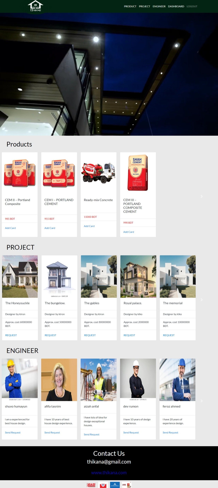

- This is the view for only showing all product or engineer or project.
  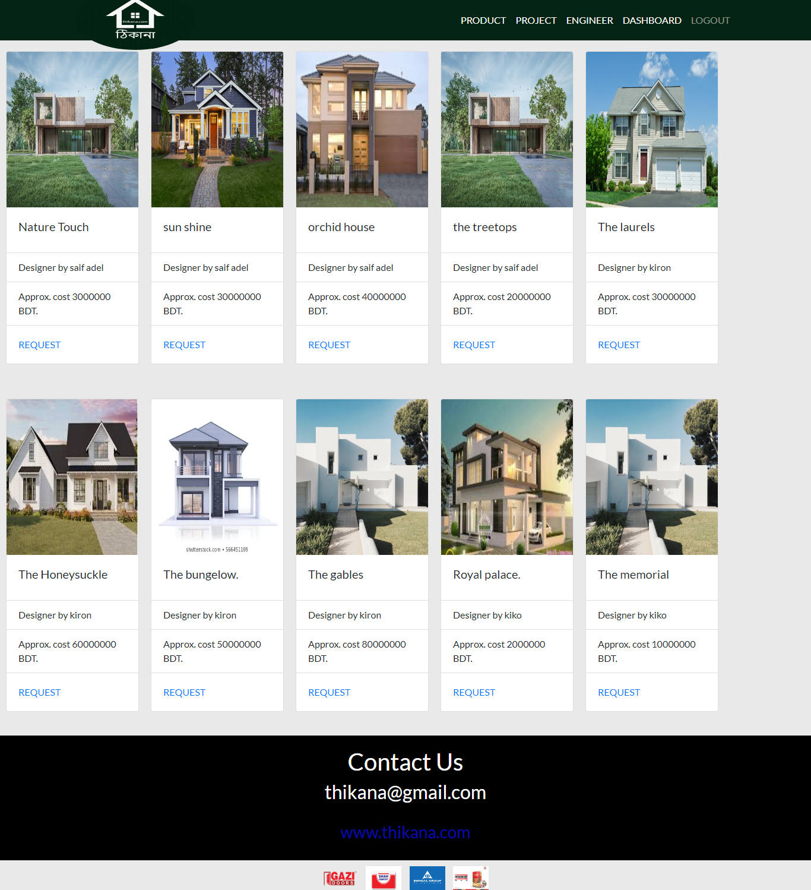
  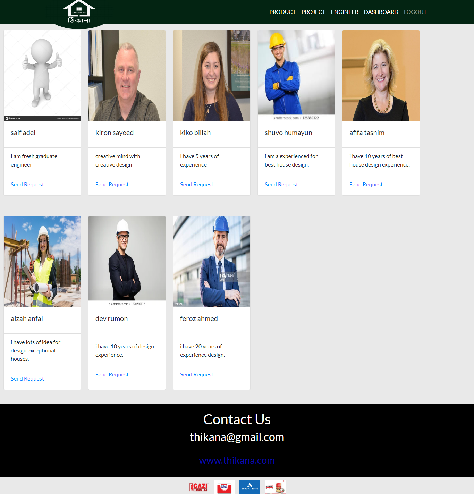
  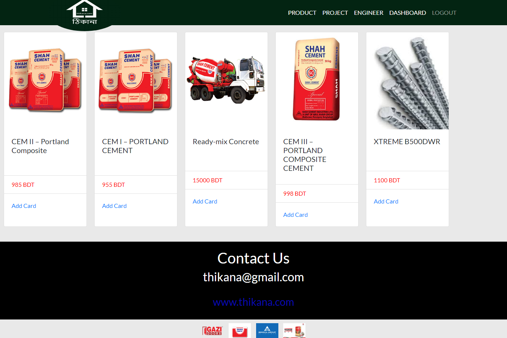

- This is the signup and signin page for the user
  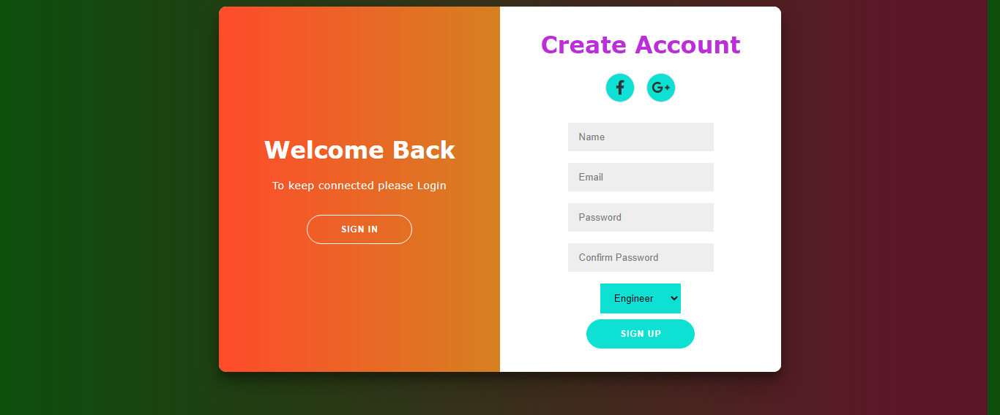
  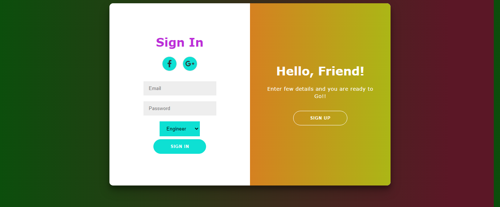

- This is the dashboard for the enginner where engineer can add project manage notification and messaging with his client.
  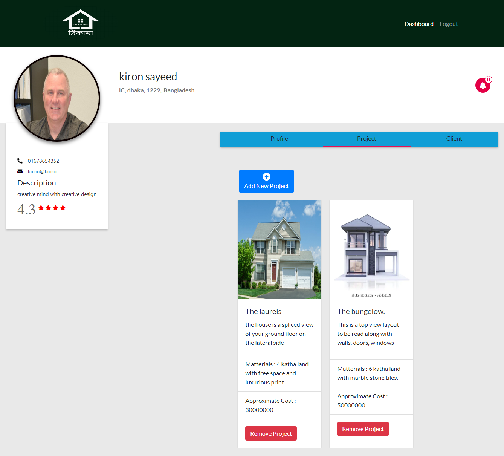

- This is the dashboard for the seller where he can add product, update product availibility and delivery status and communicate with his customer.
  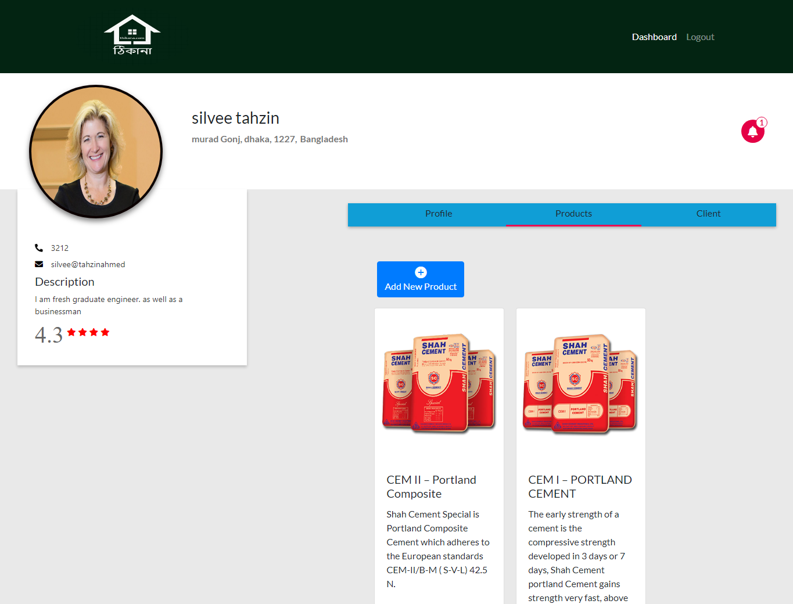

- This is the notification view and managing view
  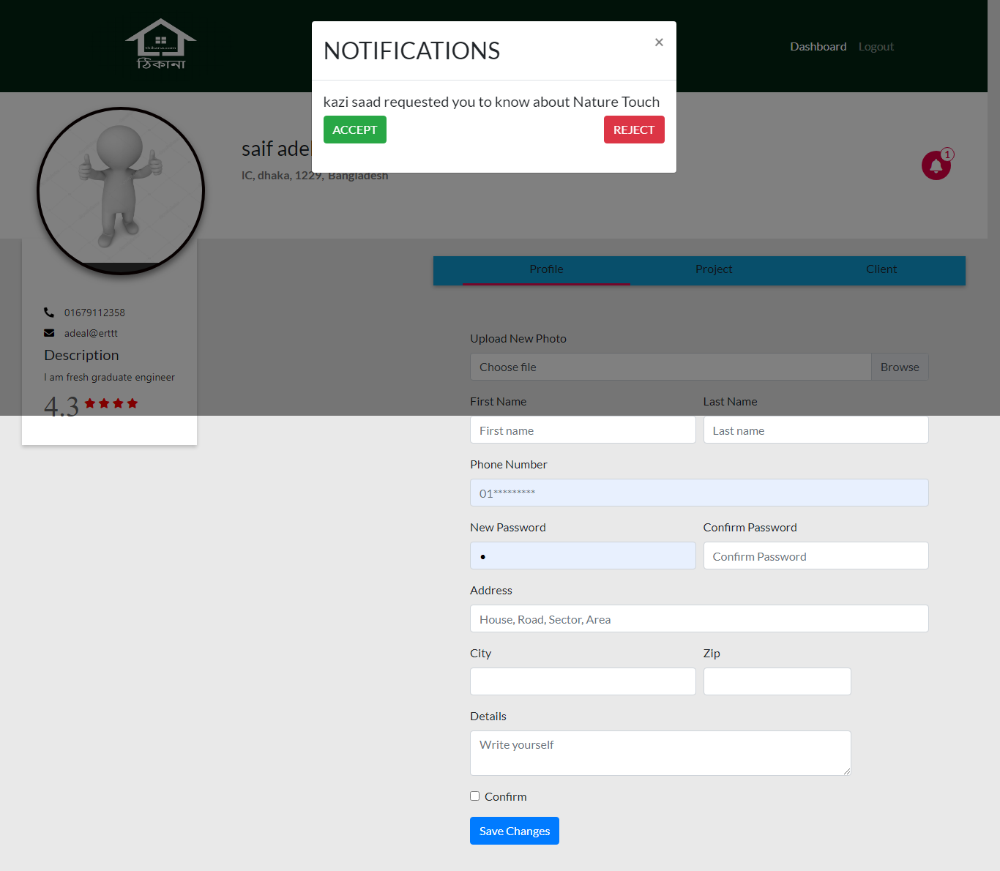

- This view for client list and messageing them
  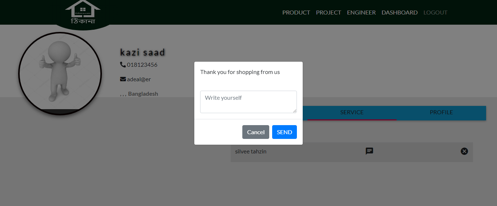

- This is the view of updating profile page
  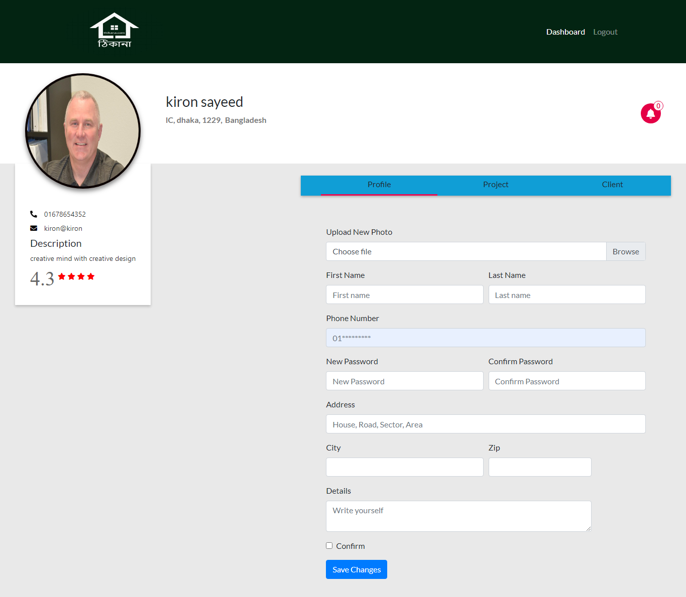
